# forge
### Forge is a Kubernetes-ready control plane for Rust background work — queues, task engines, workers, metrics, and UI, from embedded apps to multi-replica services.

A small family of Rust crates for building production job queues and the UI to run them.

## Screenshots

The `forge-jobs-ui` Mission Control panel, in production. Every tab below
is a route in the panel; charts come from `forge-charts` and update live
as the queue churns. Run yours wherever you mount the consumer-implemented
`QueueIpc` trait — Tauri desktop, plain HTTP, an in-process mock for tests.

### Tabs

**Overview** — workload timeline (enqueued / retried / completed / failed
buckets), processing-time and end-to-end latency percentiles, status-counts
strip, plus the live worker processes underneath.

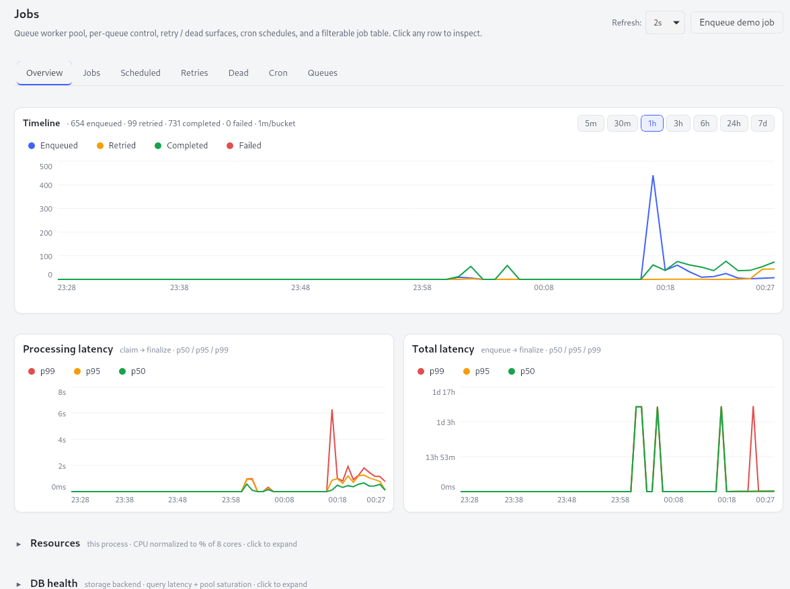

**Jobs** — filterable job list with inline payload + last-error inspector.
Filter by queue, status, kind, or substring across the payload.

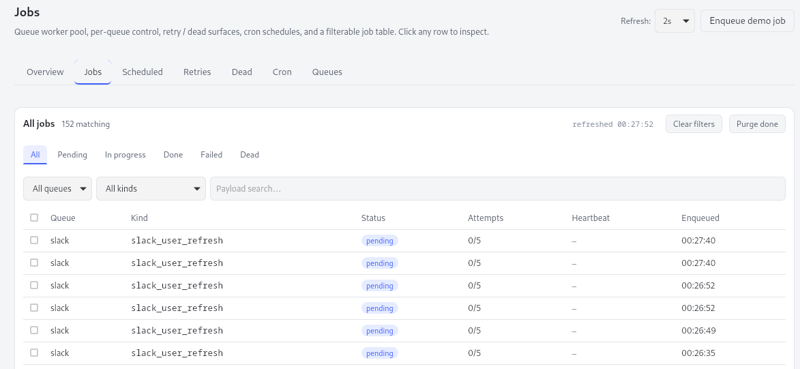

**Scheduled** — future-dated work (throttle backoffs, `with_run_at`
deferrals). Same table shape as Jobs but ordered by `scheduled_at`.

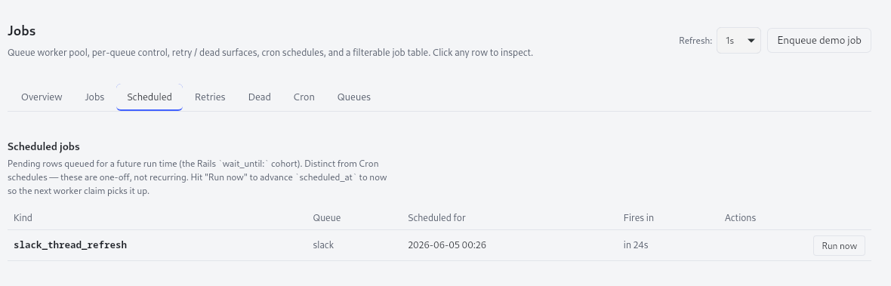

**Retries** — jobs that failed once and are waiting on their next
attempt. Useful for spotting clusters of correlated failures.

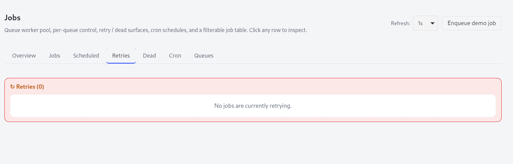

**Dead** — dead-letter inspector. Jobs past `max_attempts` or routed
straight to Dead by a handler (`JobOutcome::Dead`). Read the error
chain that landed them here; re-enqueue or drop one at a time.

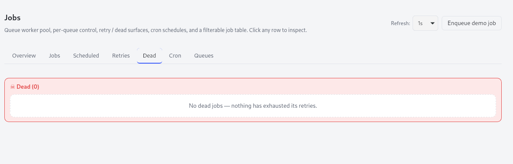

**Cron** — per-schedule status. Cron expression, next/last fire, the
job kind it enqueues, enabled / disabled toggle. Lease-elected so only
one replica fires each tick.

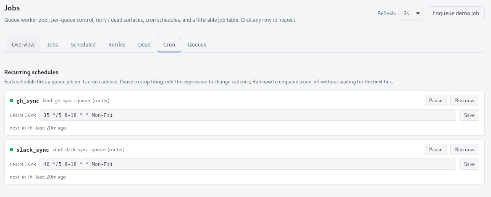

**Queues** — per-queue knobs. Worker count, retention windows, backoff
curve (`backoff_enabled` / `base_seconds` / `max_seconds`). Edits take
effect on the next tick — no worker restart.

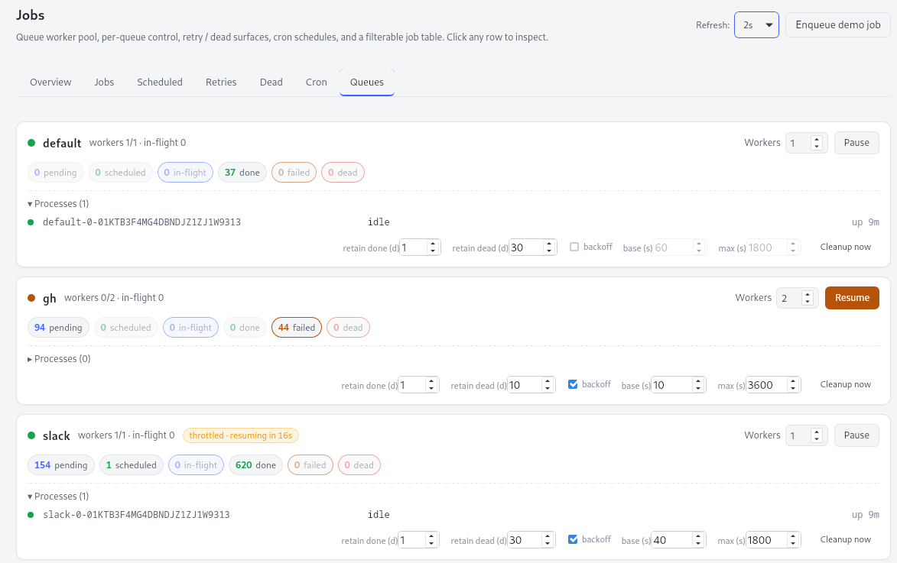

**Workers** — worker-centric health, one card per live process. Shows each
worker's name (`FORGE_WORKER_NAME`, else its host id), the queues it
declared responsibility for, the rebalancer-assigned slots per queue, its
live / in-flight worker counts, and a heartbeat-health dot. A red banner
flags any configured queue that no live worker is consuming.

### Detail panels

**Live processes** — per-process strip on the Overview tab. Each worker
shows its current job + last heartbeat. The reaper revives jobs whose
worker stops heartbeating within `HEARTBEAT_INTERVAL`.

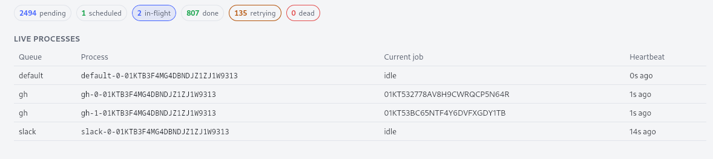

**Resources** — this-process CPU + memory + disk I/O + disk space.
Sampled every `METRICS_TICK` and aggregated into per-minute buckets
by the metrics roller (ADR 0009).

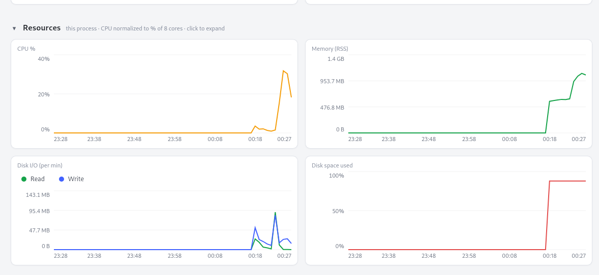

**DB health** — storage backend visibility: read/write latency
percentiles, ops-per-minute throughput, connection pool saturation.
Same shape on SQLite and Postgres.

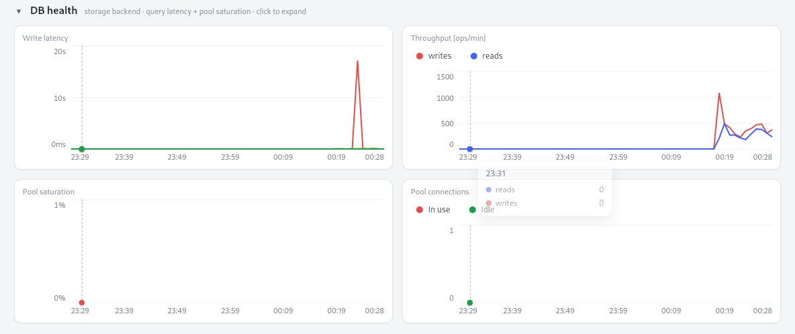

**Per-queue metrics** — per-queue latency + throughput on a configurable
time range (5m / 30m / 1h / 3h / 6h / 24h / 7d, with drag-to-zoom).
Mini chart per queue expands to the same `AreaChart` the overview uses.

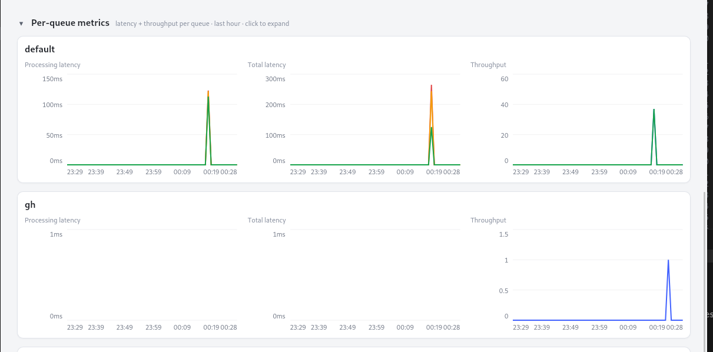

## Crates

| Crate | crates.io | docs.rs | Description |
|---|---|---|---|
| [`forge-jobs`](crates/forge-jobs/) | [](https://crates.io/crates/forge-jobs) | [](https://docs.rs/forge-jobs) | Sidekiq-style queue with embedded SQLite + pluggable Postgres. Per-queue workers, cron, cluster-wide rate-limit budget, cancellation that survives across replicas. |
| [`forge-jobs-api`](crates/forge-jobs-api/) | [](https://crates.io/crates/forge-jobs-api) | [](https://docs.rs/forge-jobs-api) | HTTP transport for `forge-jobs` (Axum routes + JSON DTOs). Drop-in for a deployed multi-replica service. |
| [`forge-jobs-ui`](crates/forge-jobs-ui/) | [](https://crates.io/crates/forge-jobs-ui) | [](https://docs.rs/forge-jobs-ui) | Reusable Leptos panel for the queue — overview, timeline, per-queue charts, cron, scheduled jobs, dead-letter inspector. Host-agnostic via a `QueueIpc` trait. |
| [`forge-charts`](crates/forge-charts/) | [](https://crates.io/crates/forge-charts) | [](https://docs.rs/forge-charts) | Pure-Rust + SVG interactive charts for Leptos CSR. No JS, no canvas, no Tailwind. Used by `forge-jobs-ui` but independent. |

## Design goals

- **Local-first, then deployable.** The same code path runs single-process on
  embedded SQLite (a desktop app, a CLI) or multi-replica on Postgres (a
  cluster). Backend traits live in `forge-jobs::storage`; pick the impl
  that fits.
- **Correctness over flash.** Every claim is atomic
  (`SELECT … FOR UPDATE SKIP LOCKED` on Postgres, single-writer pool on
  SQLite), cron schedules are lease-elected (one replica fires per tick),
  rate-limit buckets serialize across pods.
- **Cooperative cancellation.** `QueueHandle::request_cancel(&JobId)` stops
  a running job in-process; cross-replica cancels flow through a DB flag
  the worker's heartbeat observes within `HEARTBEAT_INTERVAL`. User-cancel
  routes straight to `Dead` — no retry-budget waste.
- **Per-queue exponential backoff with a clean toggle.** `Failed` and
  `Throttled` both honor the same per-queue `backoff_enabled` /
  `base_seconds` / `max_seconds`. No hardcoded constants.

## Quick start

`forge-jobs` is the core. A minimal consumer:

```rust,ignore
use std::sync::Arc;
use forge_jobs::storage::{DatabaseConfig, PathsError, QueuePaths};
use forge_jobs::{
    DefaultRouter, EnqueueRequest, HandlerRegistry, NoopEcho, QueueRuntime,
};

// Implement QueuePaths for your project's paths layer — env vars,
// `directories`, a hardcoded prod path, a tempdir for tests, etc.
#[derive(Debug)]
struct EnvPaths;
impl QueuePaths for EnvPaths {
    fn config_dir(&self) -> Result<std::path::PathBuf, PathsError> {
        Ok("./jobs/config".into())
    }
    fn data_dir(&self) -> Result<std::path::PathBuf, PathsError> {
        Ok("./jobs/data".into())
    }
}

#[tokio::main]
async fn main() -> Result<(), Box<dyn std::error::Error>> {
    let paths = EnvPaths;
    let storage = DatabaseConfig::load(&paths)?.open_storage(&paths).await?;
    let mut handlers = HandlerRegistry::new();
    handlers.register(NoopEcho);
    // Declare which queues THIS worker consumes — required. A worker
    // started with none fails at `start()`. Read them from the
    // environment in a real host: `.with_queues(forge_jobs::queues_from_env())`.
    let runtime = QueueRuntime::new(storage, handlers, Arc::new(DefaultRouter))
        .with_queues(["default".to_owned()]);
    runtime.ensure_queue("default", 2).await?;
    let handle = runtime.start().await?;
    // ... handle.shutdown_graceful(timeout) at exit
    Ok(())
}
```

See [`crates/forge-jobs/examples/minimal.rs`](crates/forge-jobs/examples/minimal.rs) for the runnable version and each crate's README for more detail.

## Architecture

```
                          ┌──────────────┐
            (your app) ──▶│ QueueRuntime │ ──▶ N worker tasks
                          └──────┬───────┘     + reaper + cleanup
                                 │              + cron + metrics
              ┌──────────────────┼──────────────────┐
              ▼                  ▼                  ▼
          ┌─────────┐    ┌──────────────┐   ┌──────────────────┐
          │JobQueue │    │ QueueConfig  │   │ RateLimitStorage │
          │         │    │              │   │                  │   …+ ProcessRegistry
          │         │    │              │   │                  │     CronStorage
          └─────────┘    └──────────────┘   └──────────────────┘
                   \           |           /
                    \          |          /
                     ▼         ▼         ▼
                     ┌──────────────────────┐
                     │   SqliteStorage  /   │
                     │   PostgresStorage    │
                     └──────────────────────┘

                          ┌────────────┐
            (your IPC) ──▶│  QueueIpc  │ (forge-jobs-ui consumer trait)
                          └─────┬──────┘
                                ▼
                          ┌──────────────┐
                          │forge-jobs-ui │  Leptos panel
                          └──────┬───────┘  ─ overview / timeline / cron / …
                                 ▼
                          ┌──────────────┐
                          │ forge-charts │  AreaChart + tooltip + zoom + theming
                          └──────────────┘
```

The storage layer is *six* traits (queue, processes, config, cron, rate-limit,
paths) and one bundle struct. Swap the backend by swapping trait impls —
nothing in the runtime moves.

## Status

`0.3` — internal API mostly stable, a few naming + restructure passes still
likely before `1.0`. Pin a specific version if you want byte-for-byte
reproducibility during this window.

## Choosing crates

- **Just need a queue?** `forge-jobs`. Works as a library with no other
  forge-* deps.
- **Building a multi-replica service?** `forge-jobs` + `forge-jobs-api`.
  The HTTP transport lets ops poke the queue without an in-process
  binding.
- **Building a desktop app or admin panel?** `forge-jobs` +
  `forge-jobs-ui`. The UI handles overview / timeline / cron / scheduled
  / dead-letter screens. You implement the `QueueIpc` trait once for your
  host (Tauri, plain HTTP, etc.).
- **Just want the chart library?** `forge-charts` is independent. No
  jobs/queue dependency.

## How it compares

A like-for-like benchmark against Sidekiq (Ruby/Redis) and solid_queue
(Rails/Postgres), all on one internal Docker network, 8-way concurrency,
no-op jobs. Full method + caveats in [docs/benchmarks.md](docs/benchmarks.md);
treat these as *relative* (single machine, default tuning).

| | Pickup p50 | End-to-end p50 | Throughput | Worker RSS |
|---|---|---|---|---|
| **Sidekiq** (Redis) | 0.47 ms | 0.71 ms | ~7.5–15k/s | 49 MiB |
| **forge-jobs** (Postgres) | 1.4 ms | 2.0 ms | ~2,000/s | **13 MiB** |
| **solid_queue** (Postgres) | 62.7 ms | 65.2 ms | ~200/s | 238 MiB |

Reading it honestly:

- **vs solid_queue** (the closest peer — both durable Postgres): forge is
  **~45× lower pickup latency** (push via `LISTEN/NOTIFY` vs polling),
  ~30× lower end-to-end, and ~10× higher throughput.
- **vs Sidekiq:** Redis/in-memory is faster — that's physics. forge's trade
  is *durable, transactional-with-your-data* jobs at push-driven
  single-digit-ms latency far closer to Redis than to a polling DB queue.
- **Worker footprint:** the Rust worker is **13 MiB** RSS — ~4× leaner than
  Sidekiq's Ruby worker, ~18× leaner than solid_queue's Rails worker.
  (Per-job CPU is comparable across all three — the measurable
  compiled-language win here is memory, not CPU.)

## Running on Postgres at scale

The embedded SQLite defaults are tuned for the single-process /
desktop case. Before pointing a multi-replica cluster or a
high-throughput workload at the Postgres backend, read
[docs/operating-at-scale.md](docs/operating-at-scale.md) — it covers the
backend-choice threshold, the vacuum/bloat tuning (and how to apply
`fillfactor` to an already-populated table), connection-pool sizing, the
single-coordinator background-work ceiling, and rate-limit-scope
contention.

### Per-worker queue affinity — many workers, one pane of glass

Point every worker at the **same database** and give each its own
responsibility. Workers can be entirely **different binaries** — `tom` is
your image-processing service, `jerry` is your email service — and they
still show up in a single **unified Mission Control**, because the database
is the source of truth and the UI/API read the whole cluster from it.

```
   FORGE_QUEUES=images          FORGE_QUEUES=email
   FORGE_WORKER_NAME=tom        FORGE_WORKER_NAME=jerry
   ┌──────────────────┐         ┌──────────────────┐
   │ worker: tom      │         │ worker: jerry    │      ┌─────────────────┐
   │ (image binary)   │         │ (email binary)   │      │ Mission Control │
   │ handlers: image_*│         │ handlers: email_*│      │  Workers / Jobs │
   └────────┬─────────┘         └────────┬─────────┘      │  Overview / Cron│
            │                            │                └────────┬────────┘
            └──────────────┬─────────────┴─────────── reads ───────┘
                           ▼
                  ┌──────────────────┐
                  │  shared Postgres │   ← single source of truth
                  └──────────────────┘
```

A worker declares the queues it consumes via `FORGE_QUEUES=images` (or
`.with_queues([...])`). The cluster honors it end-to-end — a worker only
spawns supervisors for its queues, and the coordinator's rebalancer splits
each queue's `max_workers` across only the workers that declared it. Name
workers with `FORGE_WORKER_NAME` and watch their health on the **Workers**
tab; a queue no live worker declared is flagged as **unassigned**.

**The one rule:** a worker can only run a job kind it registered a handler
for, so its `FORGE_QUEUES` must line up with the handlers compiled into that
binary — route `image_*` jobs to the `images` queue, and only the image
worker declares `images`. Declaring queues is required: a worker started
without any fails fast rather than silently draining every queue.

## Repository layout

```
forge/
├── Cargo.toml              workspace
├── README.md               (this file)
├── LICENSE-MIT
├── LICENSE-APACHE
└── crates/
    ├── forge-jobs/         the queue
    ├── forge-jobs-api/     Axum HTTP transport
    ├── forge-jobs-ui/      Leptos panel
    └── forge-charts/       SVG charts
```

## Contributing

Bug reports and PRs welcome. Each crate carries its own quality bar in
its `Cargo.toml` `[lints]` (inherits from the workspace's
`workspace.lints` — `clippy::pedantic + nursery`, `unsafe_code = "deny"`,
`unwrap_used = "deny"`).

Before opening a PR:

```
cargo fmt --all -- --check
cargo clippy --workspace --all-targets -- -D warnings
cargo clippy -p forge-jobs --features postgres --all-targets -- -D warnings
cargo test --workspace
```

The frontend crates (`forge-jobs-ui`, `forge-charts`) are WASM-only;
their clippy invocation needs `--target wasm32-unknown-unknown`.

## License

Dual-licensed under either of [Apache License, Version 2.0](LICENSE-APACHE) or
[MIT license](LICENSE-MIT) at your option.

Unless you explicitly state otherwise, any contribution intentionally
submitted for inclusion in this project by you, as defined in the Apache-2.0
license, shall be dual-licensed as above, without any additional terms or
conditions.

## Acknowledgments

Built and battle-tested inside [`tech-admin`](https://github.com/dandush03/tech-admin) — a Tauri cockpit for a 3K-person engineering org. The
queue carried ~19K activities + ~2K tickets across Slack and GitHub for
months before being broken out.
